# The Cozzy Cup Cafe Admin

React/Vite admin app for The Cozzy Cup Cafe POS, inventory, menu management, orders, receipts, sold-items reports, sales, and admin activity logs. Supabase provides Auth, Postgres, Storage, and Row Level Security.

## Live Site

https://cozy-cafe-admin.vercel.app

## Demo Video

Click the preview below to watch the project demo:

[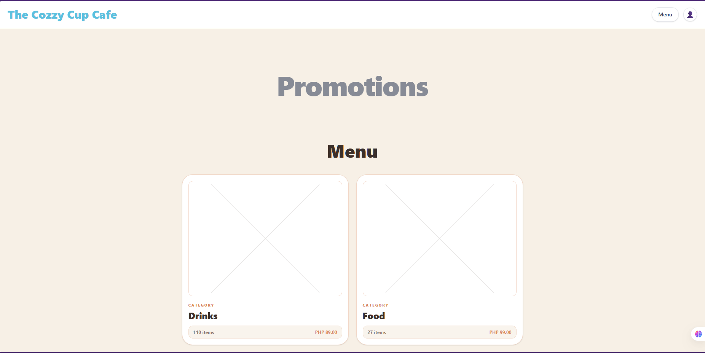](https://drive.google.com/file/d/1UxkDy-wD0IoRQep8cs4I-Llp-McwrHDK/view?usp=sharing)

[Open demo video](https://drive.google.com/file/d/1UxkDy-wD0IoRQep8cs4I-Llp-McwrHDK/view?usp=sharing)

## Features

- Google login with admin-only access
- Menu item and category management
- Inventory tracking with stock-in and stock-out
- Recipe ingredient links for automatic stock deduction
- POS order creation
- Pending orders and received receipts
- Sold-items report by day or custom date range
- Activity logs with signed-in admin email tracking
- Menu photo upload through Supabase Storage
- Mobile-friendly admin interface

## Screenshots

Screenshots are stored in `docs/screenshots`.

### Login

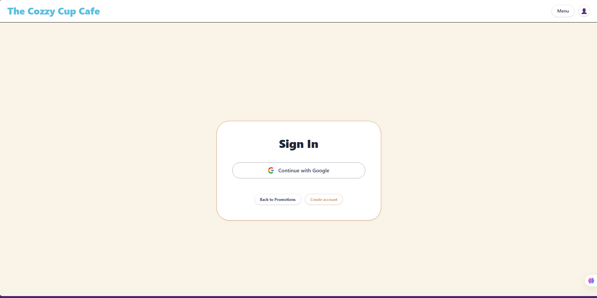

### Public Menu


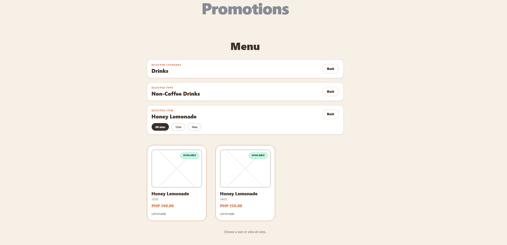

### Inventory Management

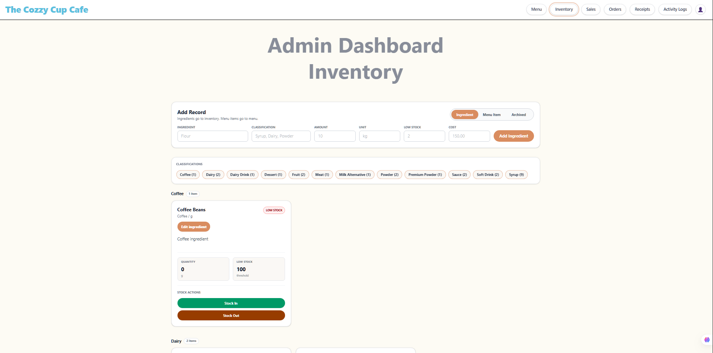

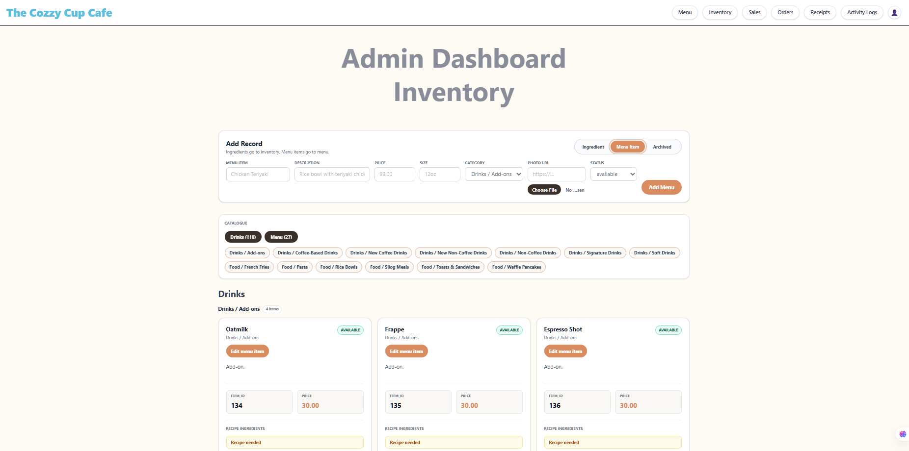

### Orders

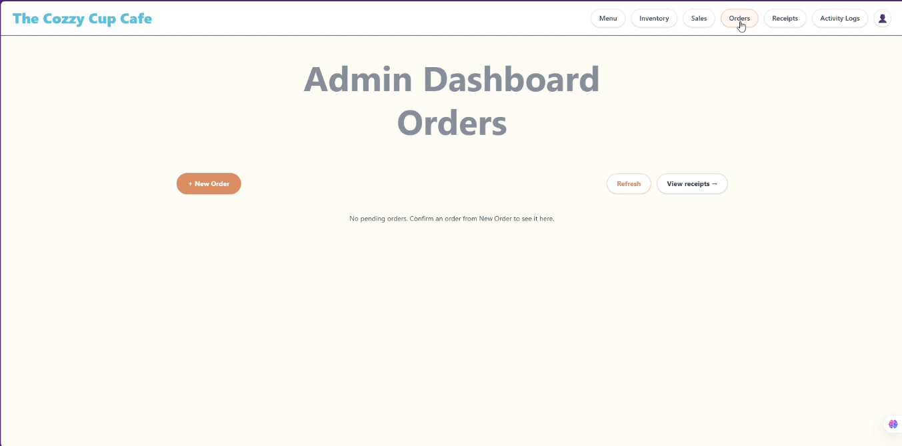

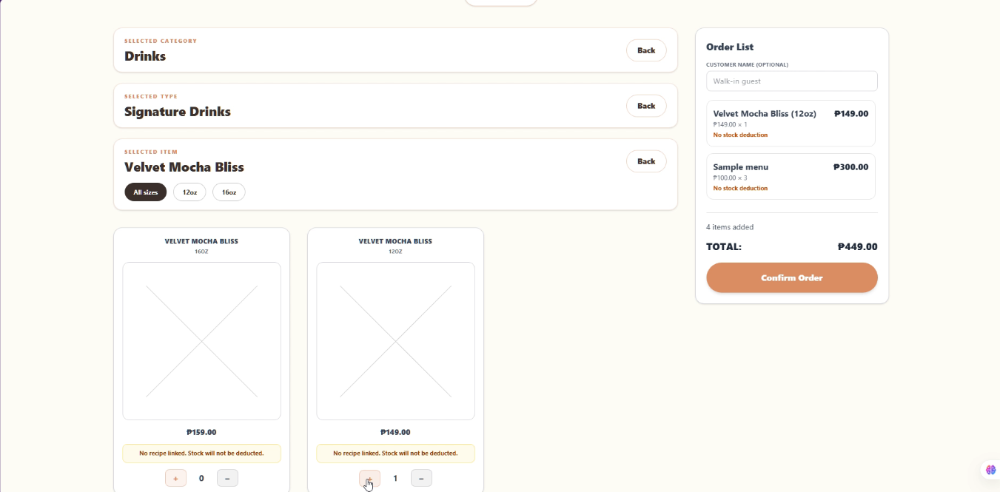

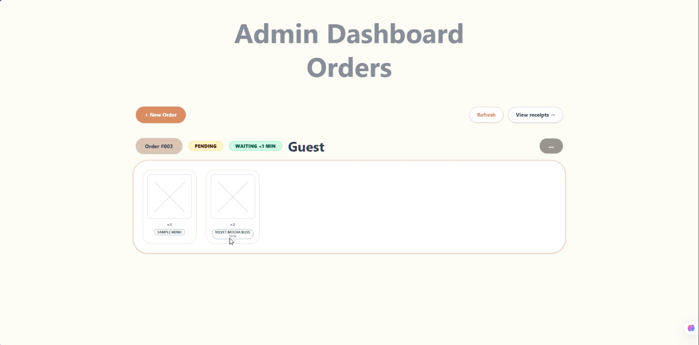

### Receipts

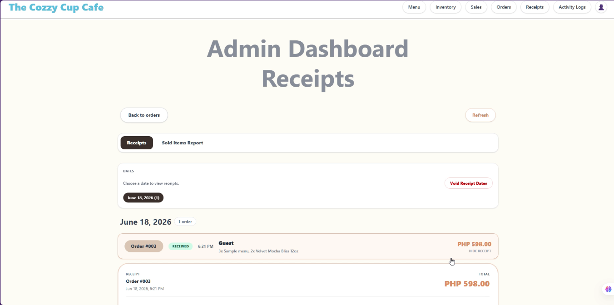

### Sold Items Report

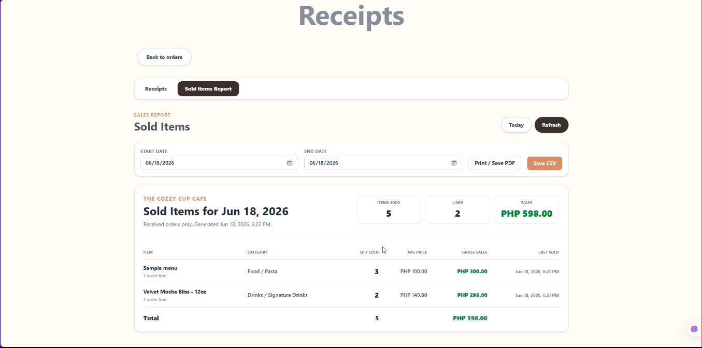

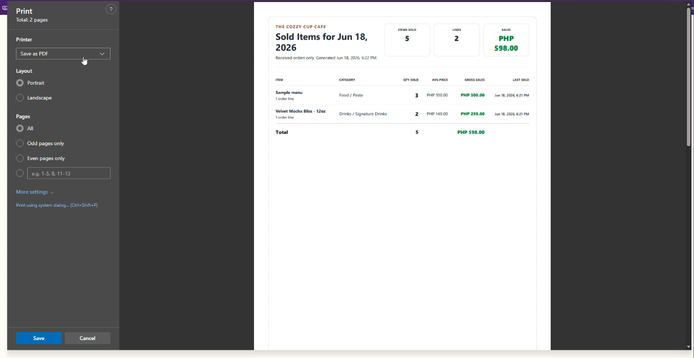

### Sales

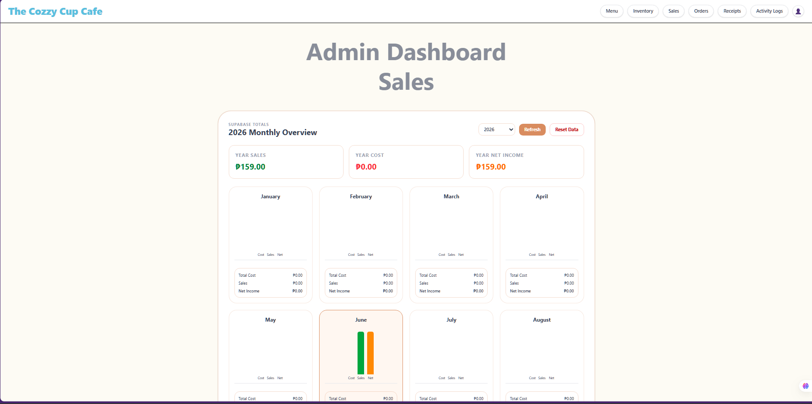

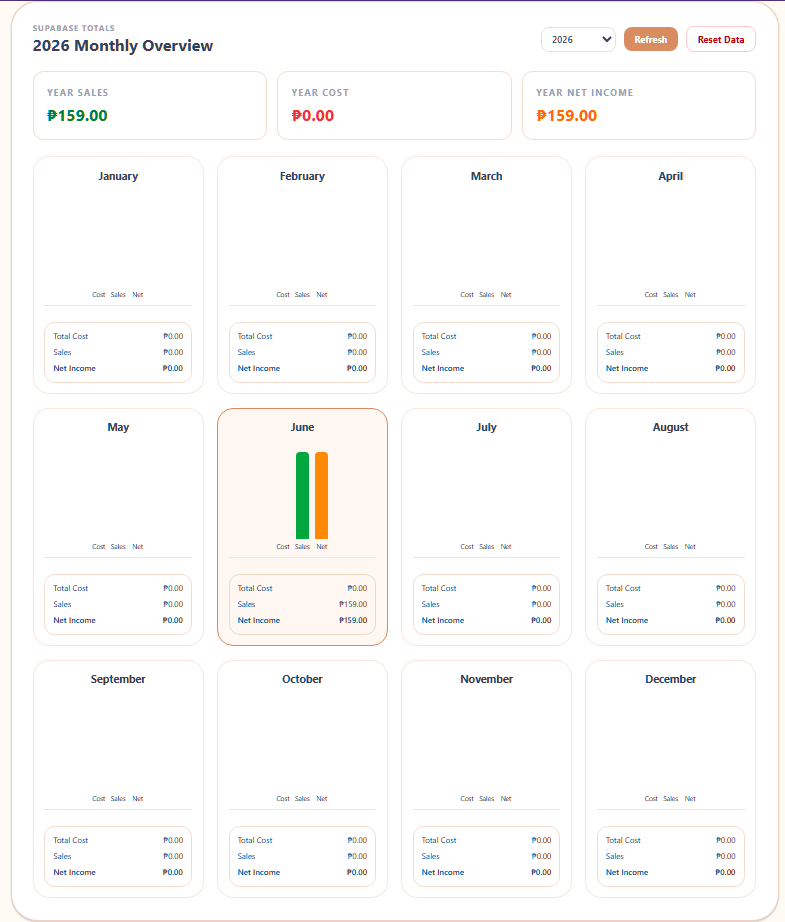

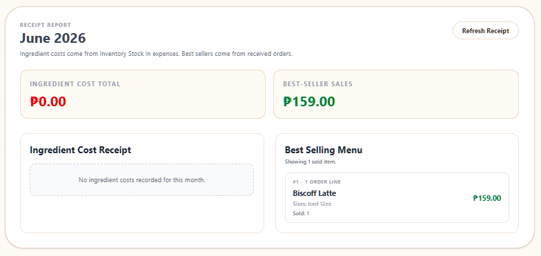

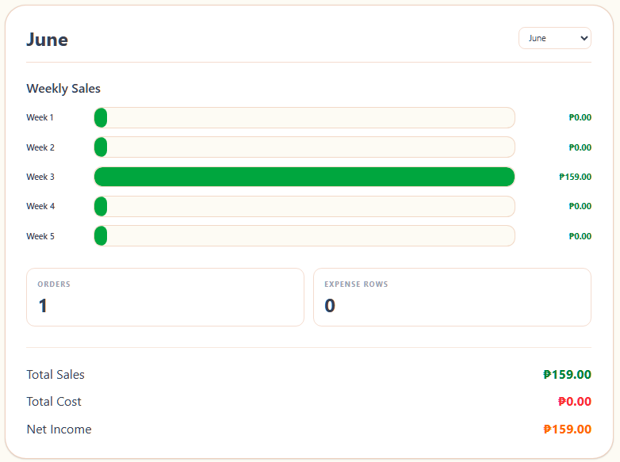

### Activity Logs

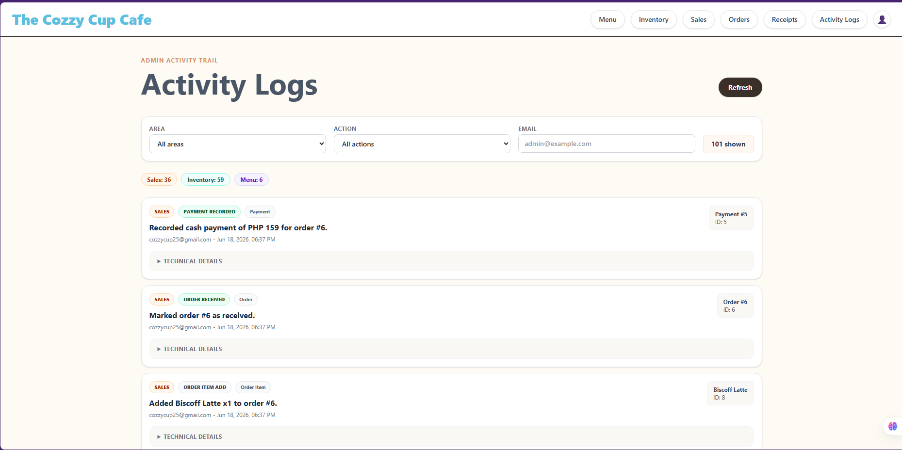

## Tech Stack

- React
- Vite
- Tailwind CSS
- Supabase Auth
- Supabase PostgreSQL
- Supabase Storage
- Supabase Row Level Security
- Google OAuth login
- Vercel deployment

## Credits

This project started as a collaborative academic draft with early contributions from:

- **Eve Nunal** - frontend development
- **Ed Baguio** - backend development

The current version was continued, completed, deployed, documented, and maintained by **Jayrad Adeva**, handling the full-stack implementation across the React/Vite frontend, Supabase database and authentication setup, inventory workflows, receipt management, reporting tools, activity logs, deployment, and client-ready refinements.

## Deployment

The app is deployed on Vercel with these settings:

- Root Directory: `test-app`
- Build Command: `npm run build`
- Output Directory: `dist`
- Install Command: `npm install`

Required Vercel environment variables:

```env
SUPABASE_URL=https://your-project-ref.supabase.co
SUPABASE_KEY=your-anon-public-key
VITE_TX_REFERENCE_ID=1
VITE_TX_CASHIER_ID=1
```

## Admin Handoff

To add a new admin, ask the user to log in once with Google from the live site. After their account appears in Supabase Authentication, run:

```sql
insert into public.user_roles (user_id, role)
select id, 'admin'
from auth.users
where lower(email) = lower('admin-email@example.com')
on conflict (user_id) do update
set role = excluded.role;
```

Then ask the user to sign out and sign in again.

## Notes

- Google login must be opened in Chrome, Safari, or another real browser. It will not work inside Messenger/Facebook in-app browser because Google blocks embedded user agents.
- Menu items without linked recipe ingredients will not deduct inventory stock.
- Admin access only works after the user logs in once and their user ID is added to `public.user_roles`.

## Prerequisites

- Node.js 18 or newer
- npm
- Supabase project
- Google Cloud OAuth client for Google login

## Local Setup

From the project root:

```bash
cd test-app
npm install
npm run dev
```

Open:

```txt
http://localhost:5173
```

## Environment Variables

`test-app/vite.config.js` reads env values from the repo root, so create or update:

```txt
.env
```

Use your Supabase project values:

```env
SUPABASE_URL=https://your-project-ref.supabase.co
SUPABASE_KEY=your-anon-public-key

VITE_TX_REFERENCE_ID=1
VITE_TX_CASHIER_ID=1
```

`SUPABASE_KEY` must be the anon public key. Never put the service role key in the frontend.

## Supabase Setup

Run SQL in this order:

1. Run the **Base Schema** from this README.
2. Run `supabase/migrations/20250515161000_one_copy_app_repair.sql`.

`20250515161000_one_copy_app_repair.sql` is the current one-copy app repair SQL. It includes the current RPC functions, admin helpers, RLS policies, menu photo storage setup, activity logs, receipt revert/delete actions, inventory protections, and report fixes.

Older migration files are kept only as historical/deprecated project records. For current setup, use the Base Schema plus `20250515161000_one_copy_app_repair.sql`.

## Base Schema

Run this first on a fresh Supabase project:

```sql
create table if not exists public.clients (
  client_id bigint generated by default as identity primary key,
  full_name text not null default 'Guest',
  contact_number text,
  created_at timestamptz not null default now()
);

create table if not exists public.cashier (
  cashier_id bigint generated by default as identity primary key,
  full_name text not null,
  role text not null default 'staff',
  login_credentials text,
  created_at timestamptz not null default now()
);

create table if not exists public.inventory (
  ingredient_id bigint generated by default as identity primary key,
  name text not null unique,
  current_quantity double precision not null default 0,
  unit_of_measure text not null default 'unit',
  low_stock double precision not null default 0,
  is_active boolean not null default true,
  classification text,
  created_at timestamptz not null default now()
);

create table if not exists public.menu (
  item_id bigint generated by default as identity primary key,
  name text not null,
  description text not null default '',
  price double precision not null check (price >= 0),
  category text not null default 'Others',
  availability_status text not null default 'available',
  inventory_ingredient_id bigint references public.inventory(ingredient_id),
  size_label text,
  image_url text,
  created_at timestamptz not null default now()
);

create unique index if not exists menu_name_category_size_uq
on public.menu (name, category, coalesce(size_label, ''));

create index if not exists menu_category_size_name_idx
on public.menu (category, size_label, name);

create table if not exists public.menu_ingredients (
  menu_ingredient_id bigint generated by default as identity primary key,
  menu_item_id bigint not null references public.menu(item_id) on delete cascade,
  ingredient_id bigint not null references public.inventory(ingredient_id),
  quantity_required double precision not null check (quantity_required > 0),
  unit_of_measure text not null default 'unit',
  created_at timestamptz not null default now()
);

create unique index if not exists menu_ingredients_menu_item_ingredient_uq
on public.menu_ingredients (menu_item_id, ingredient_id);

create index if not exists menu_ingredients_menu_item_id_idx
on public.menu_ingredients (menu_item_id);

create index if not exists menu_ingredients_ingredient_id_idx
on public.menu_ingredients (ingredient_id);

create table if not exists public.orders (
  order_id bigint generated by default as identity primary key,
  cashier_id bigint not null references public.cashier(cashier_id),
  client_id bigint references public.clients(client_id),
  total_amount double precision not null default 0,
  status text not null default 'pending' check (status in ('pending', 'received', 'voided')),
  guest_display_name text,
  voided_at timestamptz,
  void_reason text,
  created_at timestamptz not null default now()
);

create table if not exists public.order_items (
  order_item_id bigint generated by default as identity primary key,
  order_id bigint not null references public.orders(order_id) on delete cascade,
  menu_item_id bigint not null references public.menu(item_id),
  quantity integer not null check (quantity > 0),
  unit_price double precision not null check (unit_price >= 0),
  sub_total double precision not null check (sub_total >= 0),
  item_name_snapshot text,
  size_label_snapshot text,
  category_snapshot text,
  created_at timestamptz not null default now()
);

create index if not exists order_items_order_id_idx
on public.order_items (order_id);

create index if not exists order_items_menu_item_id_idx
on public.order_items (menu_item_id);

create table if not exists public.inventory_transactions (
  transaction_id bigint generated by default as identity primary key,
  ingredient_id bigint not null references public.inventory(ingredient_id),
  quantity_change double precision not null,
  transaction_type text not null,
  reference_id bigint,
  reason text,
  cashier_id bigint references public.cashier(cashier_id),
  "timestamp" timestamptz not null default now()
);

create index if not exists inventory_transactions_reference_type_idx
on public.inventory_transactions (reference_id, transaction_type);

create table if not exists public.expenses (
  expense_id bigint generated by default as identity primary key,
  expense_name text not null,
  amount double precision not null check (amount >= 0),
  category text not null default 'General',
  cashier_id bigint references public.cashier(cashier_id),
  notes text,
  expense_date timestamptz not null default now()
);

create table if not exists public.payments (
  payment_id bigint generated by default as identity primary key,
  order_id bigint not null references public.orders(order_id) on delete cascade,
  amount double precision not null default 0 check (amount >= 0),
  payment_method text not null default 'cash',
  reference_number text,
  created_at timestamptz not null default now()
);

create table if not exists public.user_roles (
  user_id uuid primary key references auth.users(id) on delete cascade,
  role text not null check (role in ('admin', 'staff', 'customer')),
  created_at timestamptz not null default now()
);

create table if not exists public.menu_categories (
  category_id bigint generated by default as identity primary key,
  name text not null,
  parent_category_id bigint references public.menu_categories(category_id) on delete set null,
  is_active boolean not null default true,
  created_at timestamptz not null default now(),
  constraint menu_categories_name_parent_uq unique (name, parent_category_id)
);

create index if not exists menu_categories_parent_category_id_idx
on public.menu_categories (parent_category_id);

create table if not exists public.activity_logs (
  activity_id bigint generated by default as identity primary key,
  created_at timestamptz not null default now(),
  actor_id uuid,
  actor_email text,
  area text not null default 'General',
  action text not null,
  entity_type text not null,
  entity_id text,
  entity_name text,
  description text not null,
  metadata jsonb not null default '{}'::jsonb
);

create index if not exists activity_logs_created_at_idx
on public.activity_logs (created_at desc);

create index if not exists activity_logs_area_action_idx
on public.activity_logs (area, action, created_at desc);

create table if not exists public.audit_logs (
  log_id bigint generated by default as identity primary key,
  created_at timestamptz not null default now(),
  actor_id uuid,
  actor_email text,
  action text not null check (action in ('INSERT', 'UPDATE', 'DELETE')),
  schema_name text not null default 'public',
  table_name text not null,
  record_pk jsonb not null default '{}'::jsonb,
  summary text,
  old_data jsonb,
  new_data jsonb
);

create index if not exists audit_logs_created_at_idx
on public.audit_logs (created_at desc);

create index if not exists audit_logs_table_action_idx
on public.audit_logs (table_name, action, created_at desc);

insert into public.cashier (cashier_id, full_name, role, login_credentials)
values (1, 'Default Cashier', 'staff', 'default-local')
on conflict (cashier_id) do nothing;
```

## Required Objects

The frontend expects these tables:

```txt
activity_logs
audit_logs
cashier
clients
expenses
inventory
inventory_transactions
menu
menu_categories
menu_ingredients
order_items
orders
payments
user_roles
```

The frontend expects these RPC functions:

```txt
apply_inventory_stock_movement
cancel_pending_order
confirm_pos_order
create_inventory_ingredient
delete_received_orders_by_date
delete_received_orders_by_ids
get_menu_public
is_admin
is_admin_app_user
list_pending_orders_with_items
list_received_orders_with_items
list_sold_items_report
mark_order_received
permanent_delete_archived_item
reset_revenue_data
void_received_orders_by_date
void_received_orders_by_ids
```

The frontend expects this Supabase Storage bucket:

```txt
menu-photos
```

## Current Order Flow

- `confirm_pos_order` creates a pending order and snapshots item names, sizes, categories, and prices.
- `mark_order_received` completes the sale, deducts linked recipe ingredients, creates the payment row, and marks the order as received.
- `cancel_pending_order` voids a pending order.
- Received receipt cleanup voids received orders and restores matching sale inventory deductions.
- Individual receipt reverting marks selected received orders as voided, restores matching inventory deductions, and removes those orders from Sales totals and sold-items reports while keeping history.
- Individual receipt deleting permanently removes selected receipt rows after restoring matching inventory deductions.
- Sold-items reports count only received orders.

Menu items can exist without recipe links, but those items will not deduct stock until recipe ingredients are linked in Inventory.

## Activity Logs

The Activity Logs page reads from `activity_logs`, which stores friendly descriptions such as:

```txt
Milk stock changed from 20 ml to 15 ml.
Americano price changed from PHP 99 to PHP 109.
Marked order #12 as received.
Recorded cash payment of PHP 249 for order #12.
Linked Milk to Cafe Latte recipe: 120 ml per item.
```

`audit_logs` still exists as a technical backup with before/after JSON. App actions made through Supabase Auth show the signed-in user's email. Direct SQL Editor changes may show `system` because they do not run through the app session.

## Google Login Setup

In Supabase:

1. Go to Authentication -> Providers -> Google.
2. Enable Google.
3. Copy the callback URL shown by Supabase:

```txt
https://your-project-ref.supabase.co/auth/v1/callback
```

In Google Cloud Console:

1. Go to APIs & Services -> Credentials.
2. Create an OAuth client ID.
3. Choose Web application.
4. Add Authorized JavaScript origin:

```txt
http://localhost:5173
```

5. Add Authorized redirect URI:

```txt
https://your-project-ref.supabase.co/auth/v1/callback
```

6. Copy the Google Client ID and Client Secret into the Supabase Google provider page.

In Supabase URL Configuration, set:

```txt
Site URL: http://localhost:5173
Redirect URL: http://localhost:5173
```

## First Admin User

Log in once with Google from the app. This creates the Supabase Auth user.

Then promote that user to admin in Supabase SQL Editor:

```sql
insert into public.user_roles (user_id, role)
select id, 'admin'
from auth.users
where email = 'your-email@example.com'
on conflict (user_id) do update
set role = excluded.role;
```

Sign out and sign in again. Admin navigation should show Menu, Inventory, Sales, Orders, Receipts, and Activity Logs.

## Optional Seed Data

Seed top-level menu categories:

```sql
truncate table public.menu_categories restart identity cascade;

insert into public.menu_categories (name, parent_category_id, is_active)
values
  ('Drinks', null, true),
  ('Food', null, true);

insert into public.menu_categories (name, parent_category_id, is_active)
select v.name, p.category_id, true
from (
  values
    ('Drinks', 'Coffee-Based Drinks'),
    ('Drinks', 'Signature Drinks'),
    ('Drinks', 'Non-Coffee Drinks'),
    ('Drinks', 'New Coffee Drinks'),
    ('Drinks', 'New Non-Coffee Drinks'),
    ('Drinks', 'Soft Drinks'),
    ('Drinks', 'Add-ons'),
    ('Food', 'Rice Bowls'),
    ('Food', 'Waffle Pancakes'),
    ('Food', 'Toasts & Sandwiches'),
    ('Food', 'Pasta'),
    ('Food', 'Silog Meals'),
    ('Food', 'French Fries')
) as v(parent_name, name)
join public.menu_categories p
  on p.name = v.parent_name
 and p.parent_category_id is null;
```

Seed starter inventory ingredients:

```sql
insert into public.inventory (
  name,
  classification,
  current_quantity,
  unit_of_measure,
  low_stock,
  is_active
)
values
  ('Caramel Sauce', 'Sauce', 0, 'ml', 100, true),
  ('Chocolate Sauce', 'Sauce', 0, 'ml', 100, true),
  ('Matcha Powder', 'Powder', 0, 'g', 100, true),
  ('Hazelnut Syrup', 'Syrup', 0, 'ml', 100, true),
  ('Vanilla Syrup', 'Syrup', 0, 'ml', 100, true),
  ('Honey Syrup', 'Syrup', 0, 'ml', 100, true),
  ('Coffee Beans', 'Coffee', 0, 'g', 100, true),
  ('Milk', 'Dairy', 0, 'ml', 1000, true),
  ('Oatmilk', 'Milk Alternative', 0, 'ml', 500, true),
  ('Chicken Wings', 'Meat', 0, 'piece', 20, true),
  ('Coco Syrup', 'Syrup', 0, 'ml', 100, true),
  ('Nestle Cream', 'Dairy', 0, 'ml', 500, true),
  ('Peach Syrup', 'Syrup', 0, 'ml', 100, true),
  ('Lychee Syrup', 'Syrup', 0, 'ml', 100, true),
  ('Green Apple Syrup', 'Syrup', 0, 'ml', 100, true),
  ('Mulberry Syrup', 'Syrup', 0, 'ml', 100, true),
  ('Strawberry Syrup', 'Syrup', 0, 'ml', 100, true),
  ('Hojicha Powder', 'Powder', 0, 'g', 100, true),
  ('Premium Matcha Powder', 'Powder', 0, 'g', 100, true),
  ('Lemon', 'Fruit', 0, 'piece', 10, true),
  ('Sprite', 'Soft Drink', 0, 'can', 10, true),
  ('Coke', 'Soft Drink', 0, 'can', 10, true),
  ('Yakult', 'Dairy Drink', 0, 'bottle', 10, true),
  ('Ice Cream', 'Dessert', 0, 'scoop', 20, true),
  ('Orange', 'Fruit', 0, 'piece', 10, true)
on conflict (name) do update
set
  classification = excluded.classification,
  unit_of_measure = excluded.unit_of_measure,
  low_stock = excluded.low_stock,
  is_active = true;
```

## Useful Maintenance SQL

Delete current menu and inventory setup:

```sql
truncate table
  public.menu_ingredients,
  public.inventory_transactions,
  public.order_items,
  public.menu,
  public.inventory
restart identity cascade;
```

Check whether the friendly logs table exists:

```sql
select to_regclass('public.activity_logs') as activity_logs_table;
```

Check the current order function:

```sql
select
  position('INSERT INTO public.payments' in pg_get_functiondef(oid)) as payment_position,
  position('CREATE TEMP TABLE tmp_ingredient_needs' in pg_get_functiondef(oid)) as ingredient_check_position
from pg_proc
where proname = 'confirm_pos_order';
```

Good result:

```txt
payment_position = 0
ingredient_check_position > 0
```

That confirms `confirm_pos_order` creates only the pending order; payment and inventory deduction happen when the order is marked received.
